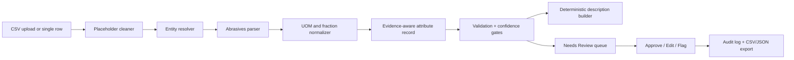

# TraceForge PIM

**TraceForge PIM** is an evidence-first product-data enrichment and validation workspace built for the UniHack industrial-commerce challenge. It accepts sparse industrial catalogue rows, removes supplier placeholders at the boundary, extracts and normalizes abrasives attributes with deterministic rules, generates constrained commerce descriptions, explains confidence, and preserves a reviewer-grade audit trail.

> **Design principle:** A fluent product description is not considered correct unless every included claim is validated by the deterministic pipeline and traceable to an input, an approved master-data entry, or a manufacturer-owned document.

## What is implemented

The prototype is deliberately optimized for **industrial abrasives**—especially cut-off discs, sanding discs, and sanding belts—because this category appears prominently in the supplied sample input. It supports both single-record preview and CSV batch intake using the supplied six-column UniHack format.

| Capability | Current behavior |
|---|---|
| Input cleaning | Maps configured supplier placeholders—including `-- Unbranded --`, `-- No Unilog Brand --`, and `-- No DIB Brand --`—to `null` before any matching, display, or generation. |
| Entity resolution | Applies exact, alias, and transparent token-overlap fuzzy matching against a representative approved-demo manufacturer/brand master. Each result exposes method, score, candidate list, and review requirement. |
| Abrasives extraction | Uses deterministic patterns to identify product type, dimensions, grit, pack quantity, material, intended use, and product line. |
| Normalization | Formats inch dimensions with a space before the unit; converts ordinary fractions and relevant decimals; preserves three-decimal abrasive-thickness values such as `0.045 in`. |
| Description firewall | Builds product title, mobile, invoice, short, and long descriptions from **validated attributes only**. Invoice descriptions are deterministically capped at 40 characters. |
| Provenance | Stores raw input span/source, extraction method, source type, corroborating manufacturer URL when configured, and an evidence excerpt for every populated attribute. |
| Validation and review | Issues deterministic pass/warning/fail checks, calculates explainable confidence, routes weak records to **Needs Review**, and permits approve, edit, or flag actions. |
| Audit model | Retains **original**, **proposed**, and **approved** values per reviewed field, plus append-only action, actor, note, and timestamp records. |
| Batch and export | Processes CSV inputs in sequential 100-row chunks, displays progress and batch metrics, reports source-row errors, and exports enriched records as CSV or JSON. |

## Architecture

The application uses a React/Tailwind interface with tRPC procedures, an Express server, Drizzle ORM, and a MySQL-compatible managed database. The enrichment path is intentionally deterministic for the MVP; there is no uncontrolled generative step that can insert unsupported technical claims.



The data model separates the enriched product record from dynamic attributes, validation issues, batches, row errors, field approval states, and audit events. This preserves a compact product schema while allowing category adapters to add controlled fields later.

## Data contracts and safeguards

The input contract is `Mfg_Part_Num`, `Part_Desc`, `E1_Brand`, `Unilog_Brand`, `DIB_Brand`, and `Part_Manuf`. A malformed header or CSV with no data rows is rejected client-side before submission. A row without `Part_Desc` becomes a persisted row-level error rather than silently disappearing.

The primary internal record comprises identity, raw/cleaned source data, canonical manufacturer and brand, classification, a dynamic attribute array, constrained descriptions, field evidence, validation issues, confidence explanation, review state, and audit events. Controlled vocabulary and UOM enforcement are modeled at field level, so a future full Unilog LOV import can replace the demonstrated abrasive rules without changing the audit contract.

The prototype reflects the core purpose of technical product classifications: ETIM describes its model as providing a uniform structure for technical product information, while ECLASS presents itself as a standard for unambiguous classification and description of products and services. [1] [2] UNSPSC is also a global system for classifying products and services. [3]

## Verified supplied-data run

The supplied `Unihack_SampleDataset-Input.csv` was profiled and then processed through the persistent batch pipeline. The audit found 1,000 input rows; all Unilog brand values and most E1/DIB brand values are configured placeholders, confirming that null cleaning must precede entity logic. The latest end-to-end run persisted all 1,000 source rows with zero row-level parse failures. Its review queue contains 955 records, which is expected because the current approved-demo master subset intentionally declines to assert canonical identity for unsupported manufacturers. This is a deliberate precision-over-coverage control—not a claim of full master-data coverage.

| Measured item | Result | Interpretation |
|---|---:|---|
| Supplied CSV rows | 1,000 | Full sample volume processed. |
| `Unilog_Brand` placeholders | 100% | These values are nulled before enrichment. |
| `E1_Brand` placeholders | 79.9% | Sparse supplier identity requires entity-resolution evidence. |
| `DIB_Brand` placeholders | 75.5% | Sparse supplier identity requires entity-resolution evidence. |
| Full-batch row failures | 0 | The supplied rows all carried a description sufficient for pipeline execution. |
| Needs Review in latest run | 955 | Appropriate human escalation where the representative master/rules cannot safely corroborate a result. |

## Manufacturer evidence policy

TraceForge never uses marketplace or distributor pages as authoritative enrichment sources. A record can use raw input evidence immediately; selected representative rows are additionally corroborated with manufacturer-owned sources. For example, the app maps `DCB518ASTS06G` to Diablo’s product page, which exposes the 1/2 in x 18 in detail-file sanding belt, multi-grade grit, pack size, and zirconium blend; 3M’s 775L page documents product form, ceramic abrasive material, supported grits, and other family properties. [4] [5]

No source is treated as proof of a different MPN simply because it looks similar. Family-level manufacturer documents are labeled as such in the evidence card; unresolved product-specific claims stay in review.

## Running and testing

Install project dependencies and start the development server with the existing project scripts:

```bash
pnpm dev
```

Use the following command to verify TypeScript and the deterministic pipeline test suite:

```bash
pnpm check && pnpm test
```

The `scripts/profile_dataset.py` script profiles the supplied raw CSV. `scripts/run_catalogue_integration.mjs` is a reproducible integration runner that loads the supplied CSV, processes it through the persistent pipeline, and reports batch metrics. It opens a database connection that may need to be stopped manually after it prints results in a local shell environment.

## Known limitations and next steps

The user-provided workspace contains the raw 1,000-row CSV but **does not contain** the referenced 200-row labelled input/output workbook, the 27,000-row approved manufacturer/brand list, the master UOM sheet, the decimal-fraction workbook, or the category LOV files. Therefore, the interface intentionally labels labelled-field accuracy as **Awaiting labels**, keeps its master scope transparent, and uses warnings/review routing rather than fabricating completeness.

The next implementation increment should ingest the supplied approved master list and LOV workbooks, map the exact Unilog delivery schema, run held-out field-level accuracy evaluation, and replace the representative fallback candidates with the client-controlled vocabularies. Manufacturer-document retrieval should then expand only through owned pages/PDFs and cached, cited extracts.

## References

[1]: https://www.etim-international.com/ "ETIM International — Classification standard for technical products"
[2]: https://eclass.eu/en/eclass-standard "ECLASS Standard — Classification and unambiguous product description"
[3]: https://www.ungm.org/public/unspsc "United Nations Global Marketplace — UNSPSC"
[4]: https://diablotools.com/products/DCB518ASTS06G "Diablo Tools — DCB518ASTS06G"
[5]: https://www.3m.com/3M/en_US/p/d/b40064963/ "3M — Cubitron II Stikit Film Disc 775L"
